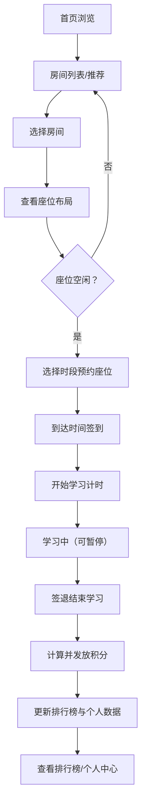

## 1. 产品概述
在线自习室平台是一款面向学生、职场人士等需要专注学习/工作环境的用户群体，提供虚拟自习空间、座位预约、签到签退、学习时长统计及积分激励机制的 Web 应用。
- 核心目的：通过游戏化的积分奖励与排行榜机制，提升用户学习动力与自律性
- 目标用户：备考学生、自由职业者、远程办公人群、终身学习者

## 2. 核心特性

### 2.1 用户角色
| 角色 | 注册方式 | 核心权限 |
|------|---------|---------|
| 普通用户 | 模拟登录（默认游客模式） | 浏览房间、预约座位、签到签退、查看积分与排行榜 |
| 管理员 | 模拟登录（默认提供 demo 账号） | 增删改房间、管理座位布局 |

### 2.2 功能模块
1. **首页（大厅）**：导航栏、统计概览、推荐房间、快速入口
2. **房间列表页**：房间卡片展示、筛选/搜索、房间状态
3. **房间详情页**：座位布局可视化、实时座位状态、预约操作
4. **签到签退页**：学习计时器、累计时长、签到/签退按钮、学习记录
5. **排行榜页**：日榜/周榜/月榜切换、积分与时长双维度排名
6. **个人中心页**：用户信息、积分明细、历史学习记录、成就徽章

### 2.3 页面详情
| 页面名称 | 模块名称 | 功能描述 |
|---------|---------|---------|
| 首页 | 统计面板 | 显示总用户数、当前在线、今日学习时长总累计 |
| 首页 | 推荐房间 | 卡片式展示热门/推荐自习室，点击进入详情 |
| 首页 | 快速入口 | 快捷跳转到排行榜、我的自习、签到入口 |
| 房间列表页 | 筛选栏 | 按房间类型、容量、是否有空位筛选 |
| 房间列表页 | 房间卡片 | 展示房间名、类型、当前人数/容量、主题色、图标 |
| 房间详情页 | 座位网格 | 可视化座位布局（如电影院座位图），显示空闲/占用/已预约状态 |
| 房间详情页 | 预约面板 | 选择时段、确认预约座位、查看预约记录 |
| 签到签退页 | 学习计时器 | 正计时显示当前已学习时长，支持暂停/继续 |
| 签到签退页 | 操作按钮 | 签到（开始计时）、签退（结束计时+计算积分） |
| 排行榜页 | Tab 切换 | 日榜 / 周榜 / 月榜切换 |
| 排行榜页 | 排名列表 | 头像、用户名、积分、学习时长，前三名高亮样式 |
| 个人中心页 | 积分卡片 | 当前积分、累计学习时长、连续签到天数 |
| 个人中心页 | 学习记录 | 日历热力图 + 近期学习历史列表 |
| 个人中心页 | 成就徽章 | 展示已解锁/未解锁成就 |

## 3. 核心流程
用户进入首页浏览推荐房间 → 进入房间列表筛选 → 选择房间查看座位 → 预约空闲座位 → 到点签到开始学习 → 学完签退获得积分 → 查看排行榜与个人中心

## 4. 用户界面设计

### 4.1 设计风格
- **主色**: 深森林绿 `#1B5E4B` — 传达安静、专注、自然的学习氛围
- **辅助色**: 暖米色 `#F5F1E8` 背景 + 琥珀金 `#D4A853` 积分/强调色
- **按钮风格**: 圆角 8px，微立体阴影，hover 浮起+颜色加深
- **字体**: 标题用「思源宋体 / Noto Serif SC」体现书卷气；正文用「Inter / 思源黑体」保证可读性
- **布局风格**: 卡片式布局 + 柔和阴影 + 大量留白营造静谧感
- **图标风格**: lucide-react 线性图标，统一 stroke 宽度

### 4.2 页面设计概览
| 页面名称 | 模块名称 | UI 元素 |
|---------|---------|---------|
| 首页 | Hero/统计区 | 渐变背景、大号数字动画、卡片 hover 浮起 |
| 房间列表 | 卡片网格 | 3 列卡片、主题色差异化、状态徽章（空闲/已满） |
| 房间详情 | 座位区 | 网格布局、不同状态色块（绿空闲/灰占用/黄已预约/蓝我的）、行号列号标注、屏幕图标 |
| 签到签退 | 计时器区 | 大号数字计时器、圆形进度环、开始/暂停/签退按钮、呼吸动画 |
| 排行榜 | 排名列表 | 金银铜前三名大卡片+冠亚季军图标、其余列表、Tab 下划线滑动动画 |
| 个人中心 | 数据概览 | 积分圆环进度、日历热力图小方块、徽章墙 |

### 4.3 响应式
桌面优先设计，主要断点：
- ≥ 1280px：三列布局（完整信息展示）
- 768px ~ 1279px：两列布局，侧边栏折叠
- < 768px：单列布局，底部 Tab 导航，简化数据展示
- 所有可点击区域移动端 ≥ 44px
