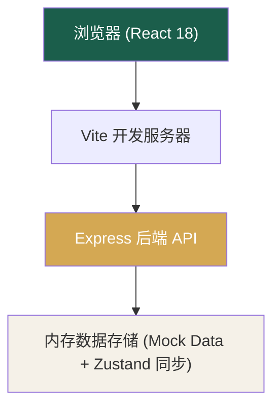

## 1. 架构设计


## 2. 技术描述
- **前端框架**: React@18 + TypeScript
- **构建工具**: Vite@5
- **UI 样式**: TailwindCSS@3 + CSS 自定义变量
- **路由管理**: React Router DOM@6
- **状态管理**: Zustand（前端全局状态）
- **后端服务**: Express@4 + TypeScript（ESM 格式）
- **图标库**: lucide-react
- **数据方案**: 纯 Mock 数据存储在后端内存中，前端通过 REST API 调用；无需真实数据库
- **初始化模板**: `react-express-ts`（前后端一体化工程）

## 3. 路由定义
| 前端路由 (React Router) | 页面用途 |
|-------|-------|
| `/` | 首页（大厅统计+推荐房间） |
| `/rooms` | 房间列表页 |
| `/rooms/:id` | 房间详情页（座位布局+预约） |
| `/study` | 签到签退页（学习计时器） |
| `/leaderboard` | 排行榜页 |
| `/profile` | 个人中心页 |
| `/login` | 模拟登录页 |

| 后端 API 路由 | HTTP 方法 | 用途 |
|-------|-------|-------|
| `/api/rooms` | GET | 获取所有房间列表 |
| `/api/rooms/:id` | GET | 获取单个房间详情（含座位状态） |
| `/api/seats/reserve` | POST | 预约座位 |
| `/api/seats/cancel` | POST | 取消预约 |
| `/api/study/checkin` | POST | 签到开始学习 |
| `/api/study/checkout` | POST | 签退结束学习（计算积分） |
| `/api/study/records` | GET | 获取学习记录列表 |
| `/api/user/info` | GET | 获取当前用户信息 |
| `/api/user/points` | GET | 获取积分明细 |
| `/api/leaderboard` | GET | 获取排行榜（日/周/月） |

## 4. API 类型定义
```typescript
// 用户
interface User {
  id: string;
  username: string;
  avatar: string;
  points: number;
  totalStudyMinutes: number;
  streakDays: number;
  level: number;
  badges: Badge[];
}

// 房间
interface Room {
  id: string;
  name: string;
  description: string;
  type: 'silent' | 'discussion' | 'focus' | 'reading';
  capacity: number;
  occupied: number;
  themeColor: string;
  icon: string;
  seats: Seat[][];
}

// 座位
interface Seat {
  id: string;
  row: number;
  col: number;
  status: 'available' | 'occupied' | 'reserved' | 'mine';
  reservedBy?: string;
  occupiedBy?: string;
}

// 预约
interface Reservation {
  id: string;
  userId: string;
  roomId: string;
  seatId: string;
  startTime: string;
  endTime: string;
  status: 'pending' | 'active' | 'completed' | 'cancelled';
}

// 学习记录
interface StudyRecord {
  id: string;
  userId: string;
  roomId: string;
  seatId: string;
  checkInTime: string;
  checkOutTime?: string;
  durationMinutes: number;
  pointsEarned: number;
}

// 排行榜项
interface LeaderboardItem {
  rank: number;
  userId: string;
  username: string;
  avatar: string;
  points: number;
  studyMinutes: number;
}

// 成就徽章
interface Badge {
  id: string;
  name: string;
  description: string;
  icon: string;
  unlocked: boolean;
  unlockedAt?: string;
}
```

## 5. 数据模型（内存存储）
后端使用内存对象存储，启动时载入初始 Mock 数据：

```typescript
interface AppData {
  users: User[];
  rooms: Room[];
  reservations: Reservation[];
  studyRecords: StudyRecord[];
  currentSession: { userId: string; recordId: string } | null;
}
```

### 数据生成策略
- **用户**: 默认 1 个当前登录用户（小明，1000 初始积分）+ 8~10 个模拟用户用于排行榜填充
- **房间**: 6 间，覆盖安静、讨论、专注、阅读四种类型，每间 24~48 个座位呈网格状
- **座位**: 每房间生成 5 行 × 8 列 = 40 座，随机分布空闲/占用/已预约
- **学习记录**: 生成过去 30 天随机学习数据用于热力图与排行榜
